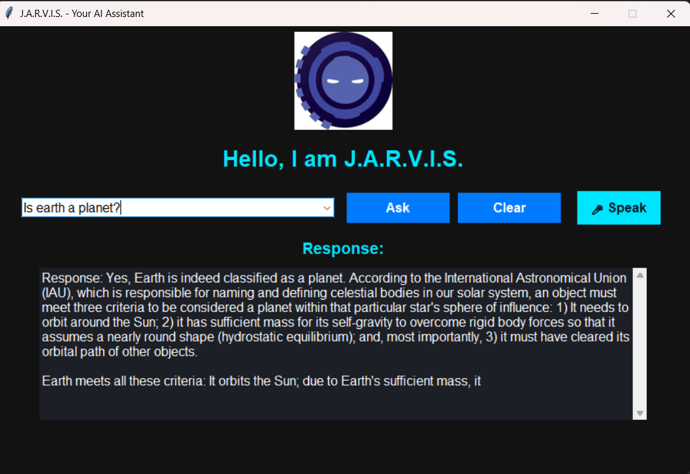

# J.A.R.V.I.S. – Your Personal Virtual Assistant 🤖

## Description
J.A.R.V.I.S. is a Python-based AI virtual assistant designed to simplify everyday tasks such as setting reminders, checking the weather, fetching news, searching for files, and answering basic conversational queries.

## Purpose
The purpose of this project is to demonstrate the integration of Python programming concepts with APIs, file I/O, and GUI development to create an intelligent desktop assistant.

## Value
- Saves time by automating common daily tasks.
- Enhances productivity through a clean and interactive interface.
- Demonstrates advanced Python skills including system integration, modular design, and GUI handling.

## APIs Used
- **OpenWeatherMap API** – For real-time weather updates
- **NewsAPI** – For fetching top news headlines

> API keys need to be inserted in `src/data/config.json` for these services to work.

## AI Features
- GPT4All integration with the **Phi-3 Mini Instruct** model
- Smart fallback to AI for unknown queries
- Voice-driven interaction pipeline using speech recognition

## Technologies Used
- **Python 3.13**
- **Tkinter** – For building the GUI
- **Requests** – For making API calls (e.g., weather, news)
- **Pillow** – For handling images (logo, GIF)
- **Pyperclip** – For clipboard access (copy file paths)
- **Webbrowser** – For opening folders from search results
- **SpeechRecognition** – For converting speech to text
- **pyttsx3** – For text-to-speech response
- **GPT4All** – For AI-based query responses (offline)

## 1. Clone the Repository
```
git clone https://github.com/udayb97/VirtualAssistant.git
cd Virtual Assistant
```
## 2. Create and Activate a Virtual Environment
```
python -m venv .venv
```
-Windows:
```
.venv\Scripts\activate
```
-macOS/Linux:
```
source .venv/bin/activate
```
## 3. Install Required Dependencies
```

pip install -r requirements.txt
```
### This will install essential packages like:

-tkinter, requests, pyttsx3, Pillow, pyperclip, SpeechRecognition, pyaudio, gpt4all

## 4. Install Additional Voice Libraries
```
pip install SpeechRecognition pyttsx3 pyaudio 
```
## Note: Make sure to double check all the libraries are installed.

## 5. Configure API Keys
-Open src/data/config.json
-Insert your valid API keys for:
--OpenWeatherMap
--NewsAPI

## 6. Download and Set Up GPT4All Model (Offline AI)
- Download the model: Phi-3-mini-4k-instruct.Q4_0.gguf
```
C:\Users\YourUsername\.cache\gpt4all\
```
## Note - You can get it from the GPT4All desktop app or official model repository.
## Note - Confirm that core.py is pointing to the correct model path
```
model_path = r"C:\Users\YourUsername\.cache\gpt4all\Phi-3-mini-4k-instruct.Q4_0.gguf"
```

## 7. Run the Application
```
python -m src.gui
```

## 8. How to interact with J.A.R.V.I.S.
-Type a question or command in the text box
-Click Ask to get a response
-Click Clear to reset the input and output
-Click Speak to give a voice command
-J.A.R.V.I.S. will also speak the response back using text-to-speech

## Folder Structure
```
VirtualAssistant/ 
│   ├── assets/ # logo and animations 
│   │   └──jarvis_logo.png
│   ├── screenshots/ # app screenshots for milestone 
│   ├── src/ 
│   │   ├── gui.py # main GUI file 
│   │   ├── core.py # assistant command logic
│   │   ├── helpers.py # Voice input and output
│   │   ├── core.py # assistant command logic
│   │   ├── helpers.py # Voice input and output
│   │   ├── conversation.py # predefined responses 
│   │   └── data/ 
│   │       ├── config.json # api
│   │       ├── reminders.txt       
│   ├── README.md
│   ├── requirements.txt 
```

##  Features Showcase
🎤 Voice Command Input

🗣️ Spoken Responses (TTS)

🌦️ Dynamic Weather Fetch by City

📰 Latest News Headlines

📁 File Search + Open + Copy

🧠 GPT4All-Powered Smart Answers (Offline AI)

📝 Add/View Reminders

💬 Fully Functional GUI

## Note: The project is fully offline once the model is downloaded. No cloud APIs needed for GPT responses.

## App Interface

Here’s how J.A.R.V.I.S. looks in action:



Click the **Speak** button to give voice commands!


# Final Notes
-This project demonstrates a seamless integration of classic Python coding, modern GUI design, system I/O, API usage, voice
 interaction, and offline AI inference.

Enjoy using J.A.R.V.I.S.! 🤖🎙️✨

